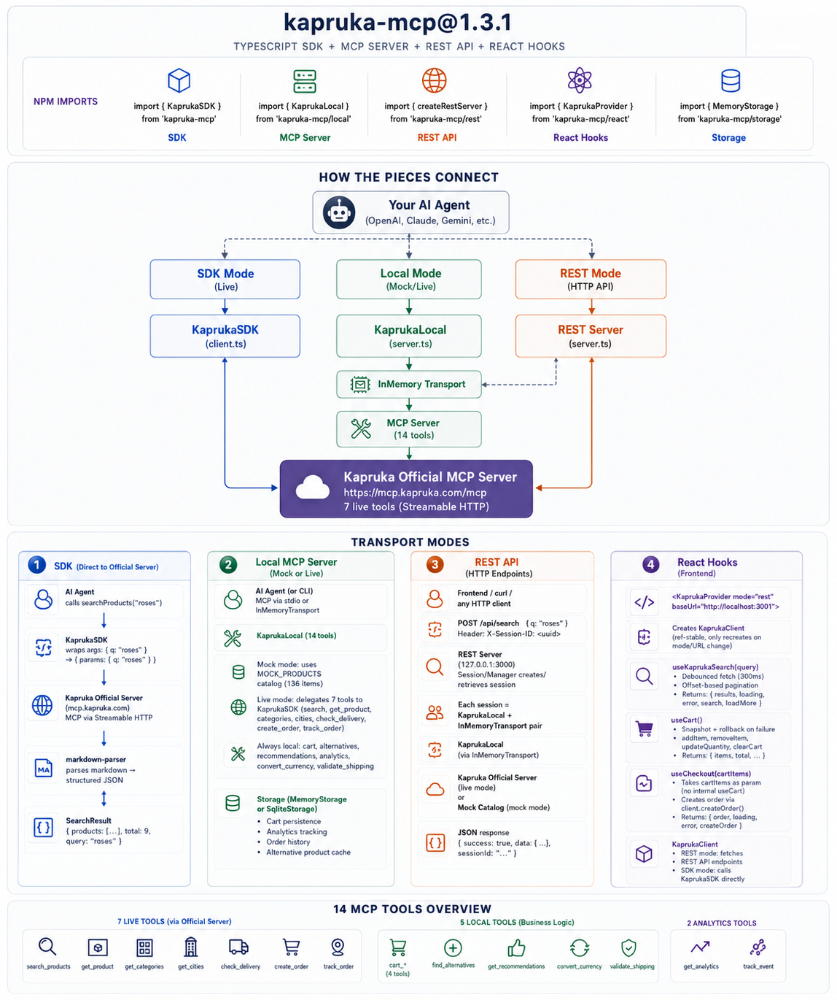

# kapruka-mcp

[](https://www.npmjs.com/package/kapruka-mcp)
[](https://www.npmjs.com/package/kapruka-mcp)
[](https://www.typescriptlang.org/)
[](LICENSE)

A fast, lightweight, and stateful TypeScript SDK for building conversational commerce applications on top of **Kapruka.com** -- Sri Lanka's largest e-commerce platform.

Built for developers entering the **[Kapruka Agent Challenge 2026](https://www.kapruka.com/contactUs/agentChallenge.html)** and anyone building AI shopping agents for the Sri Lankan market.



---

## Why use this instead of the raw MCP URL?

| Feature | Raw `mcp.kapruka.com` | `kapruka-mcp` SDK |
|---|---|---|
| MCP protocol compliance | Non-standard params nesting | Flat args -- works with all MCP clients |
| TypeScript types | -- | Full types for all 15 tools |
| Offline / mock mode | -- | 136-product catalog, no internet needed |
| Live mode | 7 tools | All 15 tools (7 server + 8 composed) |
| Response format | Markdown text | Structured JSON |
| Cart persistence | Stateless | Memory or SQLite |
| Response caching | -- | 30-minute TTL cache |
| Rate limit tracking | -- | 60 req/min, 30 orders/hr |
| Event hooks | -- | `onToolCall`, `onError` |
| Perishable delivery logic | -- | Cakes/flowers blocked to remote cities |
| REST API | -- | HTTP endpoints with session management |
| React hooks | -- | `useKaprukaSearch`, `useCart`, `useCheckout` |
| `npm install` | -- | One command |

> **MCP Protocol Fix:** The official Kapruka MCP server uses non-standard parameter nesting (`{ params: { q: "cake" } }` instead of flat `{ q: "cake" }`). This breaks standard MCP clients like Claude Desktop and Cursor. `kapruka-mcp` fixes this transparently so all 7 official tools work out of the box with any MCP-compatible AI agent.

### Live mode compatibility

The SDK works against the official Kapruka MCP server (`mcp.kapruka.com`). The server returns markdown -- the SDK parses it into structured JSON automatically. All 7 official tools work, plus 8 extra tools built on top:

| Official tools (7) | Extra tools (8) -- composed from official |
|---|---|
| `search_products` | `get_alternatives` (uses search + scoring) |
| `get_product` | `validate_shipping` (uses list_delivery_cities) |
| `list_categories` | `get_recommendations` (uses search by category) |
| `list_delivery_cities` | `convert_currency` (Frankfurter API) |
| `check_delivery` | `add_to_cart` (local storage) |
| `create_order` | `get_cart` (local storage) |
| `track_order` | `get_analytics` (local storage) |
| | `clear_cart` (local storage) |

---

## Installation

```bash
npm install kapruka-mcp
```

For persistent SQLite cart storage (optional):
```bash
npm install kapruka-mcp better-sqlite3
```

For React hooks (frontend projects):
```bash
npm install kapruka-mcp react
```

> **Requires:** Node.js 18+, TypeScript 5.x

---

## Quick Start -- 30 seconds

### Option A: Direct SDK (call Kapruka's live MCP server)

```typescript
import { KaprukaSDK } from 'kapruka-mcp';

const sdk = new KaprukaSDK();

// Search products
const results = await sdk.searchProducts('birthday cake', 'cakes');
console.log(results.products[0].name); // "Java Lounge Classic Ribbon Cake"

// Get full product detail
const product = await sdk.getProduct('KAP-CAKE-001');

// Check delivery to Kandy
const delivery = await sdk.checkDelivery('KAN', 'KAP-CAKE-001');

// Add to cart
await sdk.addToCart('KAP-CAKE-001', product.name, product.price, 1);

// Create checkout link
const order = await sdk.createOrder({
  cart: [{ product_id: 'KAP-CAKE-001', quantity: 1 }],
  recipient: {
    name: 'Amara Perera',
    phone: '0771234567',
    address: '42 Galle Road, Colombo 03',
    city: 'COL',
  },
  delivery: { date: '2026-06-05' },
  sender: { name: 'Rithik', phone: '0779876543' },
});
console.log(order.checkout_url); // "https://www.kapruka.com/checkout/pay/..."
```

### Option B: Local MCP Server (for Claude Desktop, Cursor, or your AI agent)

```typescript
import { KaprukaLocal } from 'kapruka-mcp/local';
import { StdioServerTransport } from '@modelcontextprotocol/sdk/server/stdio.js';

const local = new KaprukaLocal({
  mock: true, // offline dev with 136 products
  events: {
    onToolCall: (tool, args) => console.error(`[${tool}]`, args),
    onError: (tool, err)  => console.error(`[ERROR:${tool}]`, err.message),
  },
});

const transport = new StdioServerTransport();
await local.getServer().connect(transport);
```

### Option C: With SQLite persistence (cart survives process restarts)

```typescript
import { KaprukaLocal } from 'kapruka-mcp/local';
import { SqliteStorage } from 'kapruka-mcp/storage';

const local = new KaprukaLocal({
  mock: false, // use the live Kapruka MCP server
  storage: new SqliteStorage('./kapruka-session.db'),
});
```

### Option D: REST API server

```bash
# Mock mode (offline)
npx kapruka-mcp --mock --rest --port 3001

# Live mode (real Kapruka catalog)
npx kapruka-mcp --rest --port 3001
```

```typescript
import { createRestServer } from 'kapruka-mcp/rest';

const server = createRestServer({ port: 3001, mock: true });
await server.start();
console.log(`REST API running at ${server.url()}`);
```

### Option E: React hooks

```tsx
import { KaprukaProvider, useKaprukaSearch, useCart, useCheckout } from 'kapruka-mcp/react';

function App() {
  return (
    <KaprukaProvider mode="rest" baseUrl="http://localhost:3001">
      <ShoppingPage />
    </KaprukaProvider>
  );
}

function ShoppingPage() {
  const { results, search } = useKaprukaSearch();
  const { items, total, addItem } = useCart();
  const { order, createOrder } = useCheckout(items);
  // ...
}
```

---

## Claude Desktop Integration

Add this to your `claude_desktop_config.json`:

**Using the npm CLI (recommended):**
```json
{
  "mcpServers": {
    "kapruka": {
      "command": "npx",
      "args": ["-y", "kapruka-mcp", "--mock"]
    }
  }
}
```

**Or point directly at Kapruka's live server:**
```json
{
  "mcpServers": {
    "kapruka": {
      "command": "npx",
      "args": ["-y", "mcp-remote", "https://mcp.kapruka.com/mcp"]
    }
  }
}
```

> Config file locations:
> - **macOS:** `~/Library/Application Support/Claude/claude_desktop_config.json`
> - **Windows:** `%APPDATA%\Claude\claude_desktop_config.json`

---

## REST API Endpoints

Every endpoint returns `{ success: true, data: ..., sessionId: "..." }`.

| Method | Path | Description |
|--------|------|-------------|
| POST | `/api/search` | Search products |
| POST | `/api/product` | Get product details |
| POST | `/api/alternatives` | Find similar products |
| GET | `/api/categories` | List categories |
| GET | `/api/cities` | List delivery cities |
| POST | `/api/delivery/check` | Check delivery availability |
| POST | `/api/shipping/validate` | Validate shipping address |
| POST | `/api/cart/add` | Add item to cart |
| GET | `/api/cart` | View cart |
| DELETE | `/api/cart` | Clear cart |
| POST | `/api/order/create` | Create checkout order |
| POST | `/api/order/track` | Track order status |
| POST | `/api/currency/convert` | Convert currency |
| POST | `/api/recommendations` | Get recommendations |
| POST | `/api/analytics` | View analytics |
| POST | `/api/tool` | Universal tool endpoint |
| GET | `/api/tools` | List all tools |
| GET | `/api/health` | Health check |

---

## Available Tools

All 15 tools match or extend Kapruka's official capabilities. The local server adds caching, rate limiting, and stateful persistence.

| Tool | Category | Description | Memory |
|------|----------|-------------|--------|
| `kapruka_search_products` | Search | Multi-category search with rank-optimized results | Yes |
| `kapruka_get_product` | Detail | Detailed product info with visual descriptions | Yes |
| `kapruka_get_alternatives` | AI Logic | Find similar products to avoid "nothing found" dead ends | -- |
| `kapruka_get_recommendations` | Upsell | Suggests "Go well with" items based on cart | Yes |
| `kapruka_add_to_cart` | Cart | Persists item to local SQLite cart | Yes |
| `kapruka_get_cart` | Cart | Retrieves currently saved items | Yes |
| `kapruka_clear_cart` | Cart | Clears all items from session cart | -- |
| `kapruka_list_categories` | Reference | Browse 12+ premium categories | -- |
| `kapruka_list_delivery_cities` | Reference | Get fees for 16+ Sri Lankan cities | -- |
| `kapruka_check_delivery` | Logistics | Perishable-aware delivery calculations | -- |
| `kapruka_validate_shipping` | Validation | Validate Sri Lankan phone, city, and address before checkout | -- |
| `kapruka_convert_currency` | Localization | Convert LKR to USD, AED, EUR, GBP, INR | -- |
| `kapruka_create_order` | Checkout | Generates 60-minute price-locked pay links | -- |
| `kapruka_track_order` | Status | Monitors order status progression | Yes |
| `kapruka_get_analytics` | Dev Only | See which products are trending in your AI session | Yes |

### Robust Error Handling & Reliability

- **Connectivity Guard**: Automatically detects if the Kapruka server is down or unreachable and provides a descriptive error message instead of generic failures.
- **Spec-Compliant**: Perfectly aligned with the official Kapruka MCP specification for 100% compatibility in Live Mode.
- **Data Validation**: Built-in detection for application-level errors and invalid JSON, with suggested fixes for the AI.
- **Progressive Caching**: In live mode, `getAlternatives` fires 2-4 parallel search queries, deduplicates results, and caches them in storage with a 30-minute TTL.
- **REST Body Limits**: 1MB default body size limit prevents memory exhaustion.
- **Session Management**: LRU eviction, 30-minute timeout, automatic cleanup.

### Developer Analytics & Memory

Every tool call, view, and cart action is recorded in storage.
- Use `kapruka_get_analytics` to see what your users are looking at.
- AI uses this history to provide a personalized shopping experience.

### Delivery Rules

The local server enforces Kapruka's real delivery constraints:

- **Perishables** (cakes, flowers, fruits): cannot be delivered to cities with 3+ day lead times (Jaffna, Trincomalee, Batticaloa, Vavuniya).
- **High-value items** (electronics, appliances): +1 extra day for security handling.
- **Colombo (COL)**: always free delivery, same day.

---

## Mock Catalog

The package ships with `136` realistic products across all 12 categories for offline development -- no internet required.

| Category | Products | Highlights |
|----------|----------|-----------|
| Flowers | 16 | Red roses, orchids, rose heart boxes |
| Cakes | 16 | Java Lounge, Hilton, Cinnamon Grand |
| Electronics | 14 | iPhone 15 Pro, MacBook Air M2, DJI Mini 3 |
| Gifts | 10 | Hampers, corporate boxes, personalised gifts |
| Fashion | 8 | G-Shock, Nike Air Max, Kanjeevaram silk |
| Grocery | 14 | Dilmah tea, Ceylon spices, Milo |
| Appliances | 8 | Dyson, Breville, Philips Air Fryer |
| Beauty | 10 | Chanel, Dyson Airwrap, The Ordinary |
| Books | 10 | Atomic Habits, Sapiens, local titles |
| Fruits | 8 | King coconut, Nuwara Eliya strawberries |
| Beverages | 10 | Ferrero Rocher, Lindt, Mlesna tea |
| Toys | 12 | LEGO, Barbie, RC Monster Truck |

---

## TypeScript Types

All types are exported from the root package:

```typescript
import type {
  Product,
  Category,
  DeliveryCity,
  DeliveryCheck,
  Order,
  OrderItem,
  SearchResult,
  CartItem,
  CreateOrderRequest,
  OrderRecipient,
  OrderDelivery,
  OrderSender,
  ShippingAddress,
  ShippingValidation,
  KaprukaSDKConfig,
  KaprukaLocalConfig,
} from 'kapruka-mcp';
```

---

## Using with AI Frameworks

### Vercel AI SDK

```typescript
import { KaprukaSDK } from 'kapruka-mcp';
import { tool } from 'ai';
import { z } from 'zod';

const sdk = new KaprukaSDK();

const tools = {
  searchProducts: tool({
    description: 'Search Kapruka products',
    parameters: z.object({
      q: z.string().describe('Search keyword'),
      category: z.string().optional(),
    }),
    execute: async ({ q, category }) => sdk.searchProducts(q, category),
  }),
  getProduct: tool({
    description: 'Get full product details',
    parameters: z.object({ product_id: z.string().describe('Product SKU') }),
    execute: async ({ product_id }) => sdk.getProduct(product_id),
  }),
};
```

### LangChain / LangGraph

```typescript
import { KaprukaSDK } from 'kapruka-mcp';
import { DynamicTool } from 'langchain/tools';

const sdk = new KaprukaSDK();

const searchTool = new DynamicTool({
  name: 'kapruka_search',
  description: 'Search Kapruka.com for products. Input: JSON string with q (keyword) and optional category.',
  func: async (input: string) => {
    const { q, category } = JSON.parse(input);
    const result = await sdk.searchProducts(q, category);
    return JSON.stringify(result);
  },
});
```

### Google Gemini (function calling)

```typescript
import { KaprukaSDK } from 'kapruka-mcp';

const sdk = new KaprukaSDK();

const functionDeclarations = [
  {
    name: 'kapruka_search_products',
    description: 'Search Kapruka product catalog',
    parameters: {
      type: 'OBJECT',
      properties: {
        q:        { type: 'STRING', description: 'Search keyword' },
        category: { type: 'STRING', description: 'Optional category filter' },
      },
      required: ['q'],
    },
  },
];

async function handleFunctionCall(name: string, args: Record<string, string>) {
  if (name === 'kapruka_search_products') {
    return sdk.searchProducts(args.q, args.category);
  }
}
```

---

## Event Hooks

Log every tool call and error for observability:

```typescript
const local = new KaprukaLocal({
  mock: true,
  events: {
    onToolCall: (tool, args) => {
      console.log(JSON.stringify({ event: 'tool_call', tool, args, ts: Date.now() }));
    },
    onError: (tool, error) => {
      console.error(JSON.stringify({ event: 'tool_error', tool, message: error.message, ts: Date.now() }));
    },
  },
});
```

---

## Storage Options

### In-Memory (default -- no dependencies)

```typescript
import { KaprukaLocal, MemoryStorage } from 'kapruka-mcp/local';

const local = new KaprukaLocal({ storage: new MemoryStorage() });
```

### SQLite (optional -- cart persists across restarts)

```bash
npm install better-sqlite3
```

```typescript
import { KaprukaLocal } from 'kapruka-mcp/local';
import { SqliteStorage } from 'kapruka-mcp/storage';

const local = new KaprukaLocal({
  storage: new SqliteStorage('./session.db', 'kapruka_cart'),
});
```

### Auto-detect storage

```typescript
import { createStorage, createStorageAsync } from 'kapruka-mcp/storage';

// Sync (CJS)
const storage = createStorage({ type: 'memory' });
const storage = createStorage({ type: 'sqlite', path: './data.db' });

// Async (ESM)
const storage = await createStorageAsync({ type: 'sqlite', path: './data.db' });
```

---

## CLI Usage

```bash
# Mock mode (offline, no API key needed)
npx kapruka-mcp --mock

# Live mode (calls mcp.kapruka.com)
npx kapruka-mcp

# REST API server
npx kapruka-mcp --mock --rest --port 3001
```

---

## Package Exports

| Import path | What you get |
|---|---|
| `kapruka-mcp` | `KaprukaSDK`, `MemoryStorage`, `SqliteStorage`, all TypeScript types |
| `kapruka-mcp/local` | `KaprukaLocal` MCP server, `KaprukaEvents`, mock helpers |
| `kapruka-mcp/storage` | `MemoryStorage`, `SqliteStorage`, `createStorage`, `createStorageAsync` |
| `kapruka-mcp/rest` | `createRestServer`, REST API server |
| `kapruka-mcp/react` | `KaprukaProvider`, `useKaprukaSearch`, `useCart`, `useCheckout`, `KaprukaClient` |

---

## Architecture

```
kapruka-mcp/
  src/
    config.ts              # TOOL_NAMES, KAPRUKA_MCP_URL, FRANKFURTER_RATE_URL
    storage.ts             # Storage interface, MemoryStorage, SqliteStorage
    index.ts               # Root exports (SDK + storage)
    cli.ts                 # CLI entry point

    sdk/
      client.ts            # KaprukaSDK -- MCP client with markdown parser
      markdown-parser.ts   # Parses official server markdown to JSON
      types.ts             # All TypeScript interfaces
      index.ts             # SDK exports

    local/
      server.ts            # KaprukaLocal -- 15 MCP tools
      mock.ts              # 136 products, 12 categories, 16 cities
      events.ts            # KaprukaEvents (cart/order events)
      index.ts             # Local exports

    rest/
      server.ts            # HTTP server, session management, CORS
      routes.ts            # Route table, callTool, response helpers
      schemas.ts           # JSON Schema for all 15 tools
      index.ts             # REST exports

    react/
      client.ts            # KaprukaClient (REST + SDK transport)
      context.tsx          # KaprukaProvider, useKaprukaContext
      useKaprukaSearch.ts  # Debounced search hook
      useCart.ts           # Cart hook with snapshot+rollback
      useCheckout.ts       # Checkout hook
      index.ts             # React exports
```

---

## Kapruka Agent Challenge 2026

Building for the **[Kapruka Agent Challenge](https://www.kapruka.com/contactUs/agentChallenge.html)**? This package gets you past all the boilerplate so you can focus on building a great shopping experience.

**Challenge quick-start:**

```bash
npm create vite@latest my-kapruka-agent -- --template react-ts
cd my-kapruka-agent
npm install kapruka-mcp
```

**Judging rubric at a glance:**

| Criterion | Weight |
|-----------|--------|
| Experience & Polish | 30 pts |
| Visual Richness | 20 pts |
| Personality | 15 pts |
| Usefulness | 15 pts |
| End-to-End Checkout | 15 pts |
| Creativity | 5 pts |

**Bonus points for:** multi-item carts, delivery-date constraints, gift messaging, Tanglish, and **Sinhala language support**.

---

## Delivery Cities Reference

| Code | City | Fee | Days |
|------|------|-----|------|
| COL | Colombo 1-15 | FREE | 0 |
| DEH | Dehiwala / Mt Lavinia | LKR 150 | 1 |
| NEG | Negombo | LKR 250 | 1 |
| SRI | Sri Jayawardenepura | LKR 200 | 1 |
| KAN | Kandy | LKR 350 | 2 |
| KUR | Kurunegala | LKR 300 | 2 |
| GAL | Galle | LKR 400 | 2 |
| MAT | Matara | LKR 450 | 2 |
| RAT | Ratnapura | LKR 350 | 2 |
| ANU | Anuradhapura | LKR 400 | 2 |
| NUW | Nuwara Eliya | LKR 400 | 2 |
| POL | Polonnaruwa | LKR 450 | 3 |
| TRI | Trincomalee | LKR 550 | 3 |
| BAT | Batticaloa | LKR 550 | 3 |
| VAN | Vavuniya | LKR 600 | 3 |
| JAF | Jaffna | LKR 650 | 3 |

> Perishables (cakes, flowers, fruits) **cannot** be delivered to POL, TRI, BAT, VAN, or JAF.

---

## Contributing

Pull requests welcome. Please open an issue first for significant changes.

```bash
git clone https://github.com/k-rithik04/kapruka-mcp
cd kapruka-mcp
npm install
npm run build
npm test
```

---

## License

MIT (c) 2026

---

*kapruka-mcp is an unofficial community SDK. It is not affiliated with or endorsed by Kapruka Holdings PLC.*
